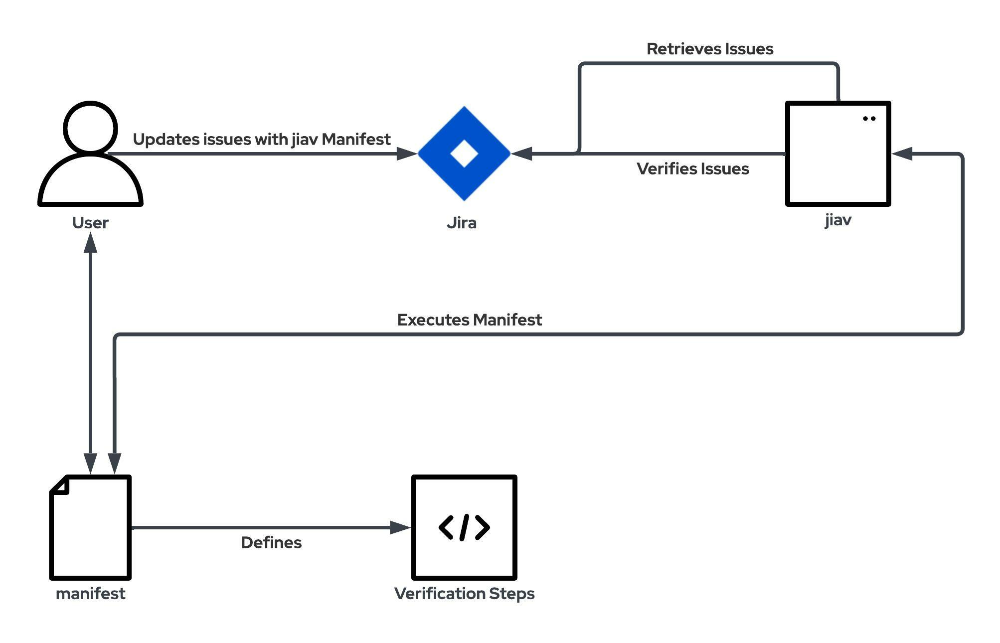

###################
 Design Philosophy
###################

**********
 Overview
**********

The goal of this project is to implement an 'auto verification'
workflow, which aims to be generic.

'auto verification' is a procedure where an automated workflow will
fetch and verify issues seamlessly.

****************************
 Auto Verification Workflow
****************************

***********
 jiav flow
***********

-  Access the Jira instance using a personal access key.
-  Recurse over Jira issues (provided by JQL or manually).
-  In each issue, recurse the comments from latest to oldest.
-  Check for a valid ``jiav`` manifest (only in private comments by
   default).
-  If a manifest is valid, execute the verification steps.
-  If the execution is successful, verify the issue.

Step 1 - Jira Issues Of Interest (“The what”)
=============================================

Issues are marked as 'Issues Of Interest' by the user.

Marked issues are at the **center** of the workflow.

Automation workflows will go through all relevant issues, and will
attempt to perform a user-defined logic in an automated way to try to
verify the issue.

Having a user-defined input is beneficial due to the following:

#. Lowering the barrier of entry - allows a diverse audience to set
   rules which are performed in an automated way without being
   proficient in the workflow.

#. ‘Truly generic’ - define a robust software-like interface (set of
   rules/API) which will allow automation to scale with the use cases
   without enforcing hard-coded scenarios.

Step 2 - Auto Verification Issues Of Interest (“The why”)
=========================================================

**Inspired by Continuous Integration(CI)**.

Developers maintain robust CI infrastructures for their products and
strive to have automation for each supported use case that is being
provided/sold to the customers/community.

CI is being run and validated on each release which is deemed worthy by
the developers.

Leveraging the CI for each release will allow developers to execute
automation to check and validate issues with minimal manual interaction
for each release.

Step 3 - Auto Verification Procedure (“The how”)
================================================

Based on a user-defined logic, procedures will be executed and will be
handled accordingly.
